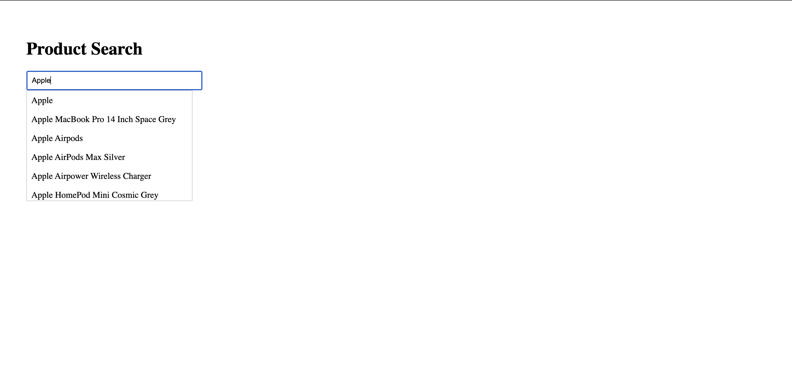

# 🔍 Autocomplete Component (React + JavaScript)

This is a simple and modular **Autocomplete Component** built using **React** and **JavaScript**. It allows users to search for products using a public API, with real-time suggestions shown in a dropdown. The project includes debouncing, loading indicators, and click-to-select functionality.

---

## 🚀 Features

- 🔍 Autocomplete input with live suggestions
- 🐌 Debounced API calls (500ms delay)
- ⌛ Loading indicator while fetching
- ✅ Dropdown suggestion list
- 🖱️ Click on a suggestion to populate input
- ⚠️ Error handling for failed API requests
- 📦 Built with Axios and React Hooks

---

## 🧰 Tech Stack

- **React (JavaScript)**
- **Axios**
- **DummyJSON API**: [https://dummyjson.com/products/search](https://dummyjson.com/products/search)

---

## 🛠️ Setup Instructions (Local Environment)

### 1. Clone the Repository

```bash
git clone https://github.com/sdass1918/AutoComplete.git
```

### 2. Install Dependencies

```bash
npm install
```

### 3. Start the Development Server

```bash
npm run dev
```

Your app will be live at:
👉 http://localhost:3000

---

## 📁 Project Structure

```bash
src/
├── components/
│   ├── Autocomplete.js     # Main search logic
│   ├── Dropdown.js         # Suggestion list
│   └── Loader.js           # Loading indicator
├── hooks/
│   └── useDebounce.js      # Custom hook for debounce
├── App.js                  # App entry point
└── index.js
```

## 🧠 How It Works

1. User types in the input field.
2. Input is debounced using a custom useDebounce hook.
3. After 500ms and if the query is 2 or more characters long:
   - An API call is made to https://dummyjson.com/products/search?q=yourQuery
4. Results are displayed in a dropdown list.
5. When a user clicks on a result:
   - That value is placed into the input field.
   - The dropdown is hidden.

## 🔧 Customization

You can tweak the following:

- **Debounce delay**: Change the `500` in `useDebounce.js` to adjust the wait time.
- **Pagination**: Use `skip` and `limit` parameters to add `Next`/`Previous` buttons.
- **Styling**: Improve styling using CSS Modules, Tailwind CSS, or UI libraries like Material UI.

## 📬 API Reference

GET https://dummyjson.com/products/search  
Query Parameters:

- q: search string
- limit: number of results to return
- skip: pagination offset

Example:

```bash
https://dummyjson.com/products/search?q=phone&limit=10&skip=0
```

## 📸 Demo Screenshot



## 🙋‍♂️ Author

Built with ❤️ by Sudipta Das
